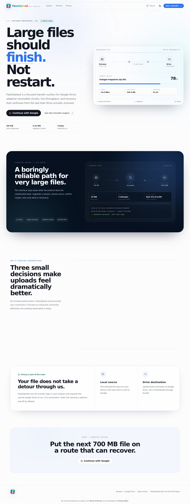
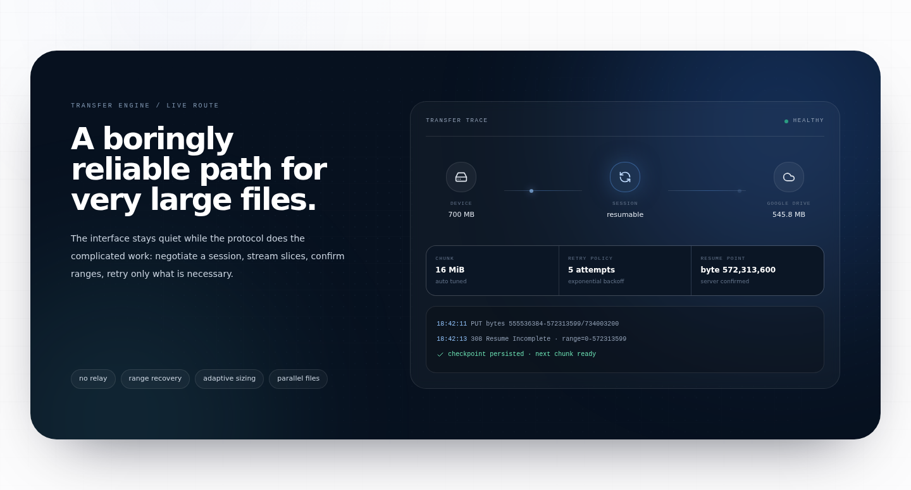
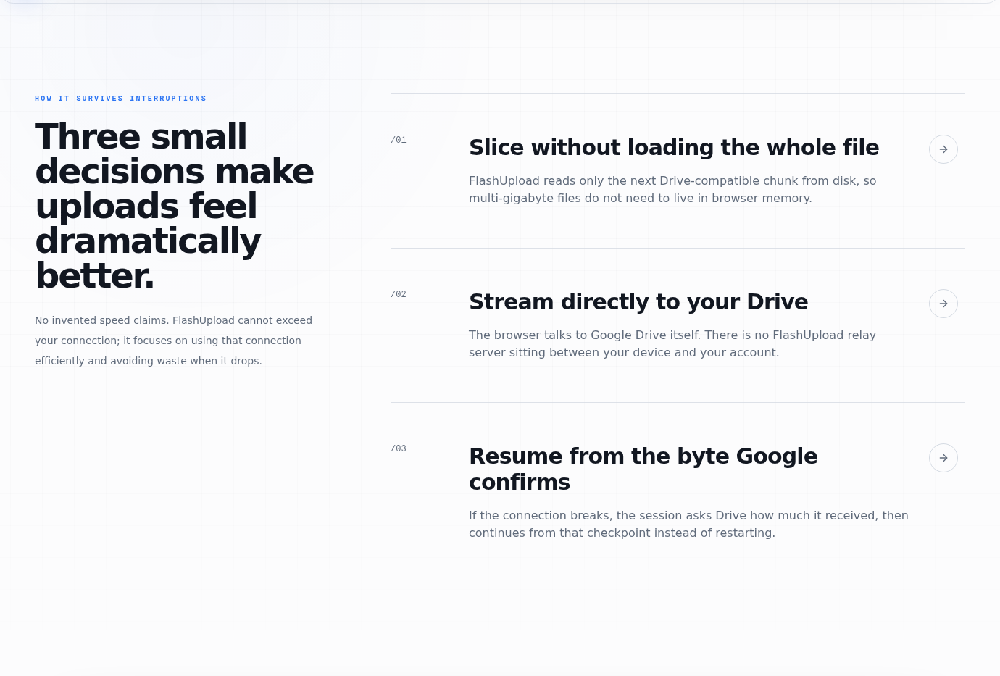
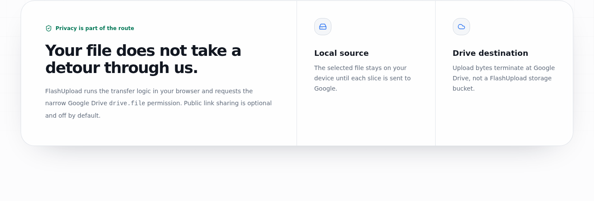

<p align="center">
  
</p>

<p align="center">
  <strong>Upload large files to Google Drive with a cleaner, more reliable workflow.</strong>
</p>

<p align="center">
  <a href="https://flashupload.cassielae.me/">Open FlashUpload</a>
  &nbsp;·&nbsp;
  <a href="https://flashupload.cassielae.me/privacy">Privacy</a>
  &nbsp;·&nbsp;
  <a href="https://flashupload.cassielae.me/terms">Terms</a>
</p>

---

## FlashUpload

FlashUpload is a simple Google Drive upload workspace made for large files, interrupted connections, and people who want an easier way to keep uploads organized.

Sign in with Google, choose where your files should go, start the upload, and keep an eye on everything from one clean workspace. FlashUpload also gives you basic file and folder management so you do not need to jump between different screens just to organize what you uploaded.

<p align="center">
  <a href="https://flashupload.cassielae.me/"><strong>Try FlashUpload</strong></a>
</p>

## Real product previews

The images below are captured directly from the live FlashUpload production site. They are not generated UI mockups.

### Home

<p align="center">
  
</p>

### Transfer engine

<p align="center">
  
</p>

### Resumable upload flow

<p align="center">
  
</p>

### Privacy-first route

<p align="center">
  
</p>

## What you can do

<table>
  <tr>
    <td width="64" align="center"></td>
    <td><strong>Resume interrupted uploads</strong><br/>A dropped connection does not have to mean starting again from zero. FlashUpload is designed to continue supported uploads from their saved progress.</td>
  </tr>
  <tr>
    <td width="64" align="center"></td>
    <td><strong>Upload to your Google Drive</strong><br/>Your files are uploaded to your own Google Drive account and remain part of your normal Drive storage.</td>
  </tr>
  <tr>
    <td width="64" align="center"></td>
    <td><strong>Keep files organized</strong><br/>Create folders, browse them, rename items, move files, and manage your FlashUpload workspace without leaving the app.</td>
  </tr>
  <tr>
    <td width="64" align="center"></td>
    <td><strong>See what is happening</strong><br/>Follow upload progress, speed, remaining time, completed transfers, retries, and failed uploads from one place.</td>
  </tr>
  <tr>
    <td width="64" align="center"></td>
    <td><strong>Manage files more easily</strong><br/>Open items in Drive, move them to Trash, restore them when needed, or permanently remove them.</td>
  </tr>
  <tr>
    <td width="64" align="center"></td>
    <td><strong>Privacy-friendly by design</strong><br/>File data goes from your browser to Google Drive. FlashUpload does not need to act as a separate storage server for your uploaded files.</td>
  </tr>
</table>

## How it works

<table>
  <tr>
    <td width="34"><strong>01</strong></td>
    <td><strong>Connect Google</strong><br/>Open FlashUpload and continue with your Google account.</td>
  </tr>
  <tr>
    <td width="34"><strong>02</strong></td>
    <td><strong>Choose a folder</strong><br/>Use the FlashUpload workspace or create a folder for the files you want to upload.</td>
  </tr>
  <tr>
    <td width="34"><strong>03</strong></td>
    <td><strong>Start uploading</strong><br/>Choose one or more files and monitor them from the Transfers page.</td>
  </tr>
  <tr>
    <td width="34"><strong>04</strong></td>
    <td><strong>Manage the result</strong><br/>Open, rename, move, restore, or remove uploaded items from the workspace.</td>
  </tr>
</table>

## Made for real-world uploads

FlashUpload is useful when you are working with files that are large enough to make a failed upload frustrating. It is a good fit for project archives, videos, design assets, backups, college work, client deliveries, photo collections, and other files that you want stored in Google Drive.

It does not make your internet connection faster than its actual upload speed. Its goal is to make the upload process more dependable, easier to follow, and less painful when a connection is unstable.

## Workspace features

- Large-file uploads with resumable progress
- Multiple file transfers
- Pause, resume, cancel, and retry controls
- Upload progress, speed, and estimated remaining time
- Folder creation and navigation
- Search and sorting
- List and grid views
- Rename and move actions
- Trash, restore, and permanent delete
- Open files directly in Google Drive
- Optional link sharing after upload
- Light and dark appearance
- Transfer and help screens

## Privacy

FlashUpload is designed so your uploaded file contents do not need to pass through a separate FlashUpload file server. The browser communicates with Google services for sign-in and Drive operations.

Public sharing is optional and is not enabled automatically.

Read the full policies here:

- [Privacy Policy](https://flashupload.cassielae.me/privacy)
- [Terms of Service](https://flashupload.cassielae.me/terms)

## Use FlashUpload

<p align="center">
  <a href="https://flashupload.cassielae.me/"><strong>https://flashupload.cassielae.me</strong></a>
</p>

No separate desktop app is required. Open the site in a modern browser, connect Google, and begin uploading.

## For contributors

FlashUpload is open source. If you want to run the project locally:

```bash
npm install
npm run dev
```

Before submitting changes:

```bash
npm test
npm run build
```

Please keep user-facing changes simple, functional, and consistent with the existing interface.

## Security

If you find a security issue, please follow the instructions in [SECURITY.md](SECURITY.md) instead of opening a public issue with sensitive details.

## License

MIT © 2026 cassielxyz
