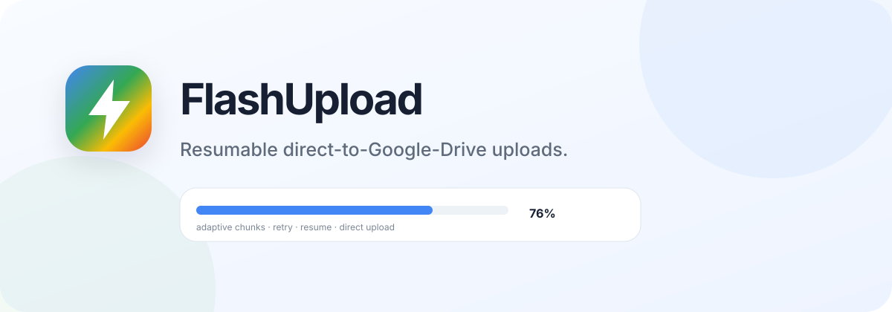

<p align="center">
  
</p>

# FlashUpload

FlashUpload is a browser-first large-file uploader and app-owned Google Drive workspace. It uses Google Drive's official resumable-upload protocol so file bytes travel **directly from the user's browser to Google Drive** instead of passing through a FlashUpload relay server.

Production: **https://flashupload.cassielae.me/**

The authenticated experience now behaves like a focused Drive workspace: files and folders created through FlashUpload can be listed, searched, opened, renamed, moved, trashed, restored, and deleted while keeping the narrow `drive.file` OAuth scope. Light mode is the default; dark mode is built in.

## What it solves

A normal large upload can be painful when a connection drops near the end. FlashUpload keeps a Google Drive resumable session, uploads sequential Drive-compatible chunks, verifies the byte range Google accepted, and retries transient failures. If the page is reloaded, the user can reselect the same local file and FlashUpload can reuse the saved resumable session while it is still valid.

FlashUpload **cannot exceed the physical upload bandwidth of the user's connection**. Its goal is to use the available connection efficiently and make interruptions much less expensive.

## Features

- Direct browser → Google Drive transfers; no application file relay.
- Google Identity Services OAuth with the narrow `drive.file` permission.
- App-owned `FlashUpload` Drive folder created on first use.
- Real folder navigation and breadcrumbs.
- Create folders and upload directly into the current folder.
- List/grid file views with sorting and search.
- Rename and move files/folders.
- Move to Trash, restore, and permanently delete.
- File/folder details and Open in Drive actions.
- Useful Google API error diagnostics instead of opaque status-only failures.
- Official Google Drive resumable upload sessions.
- Adaptive 8 / 16 / 32 MiB chunks, always aligned to Drive's 256 KiB chunk requirement.
- Server-confirmed resume points using Drive's `Range` response header.
- Exponential retry with jitter for `408`, `429`, and `5xx` responses.
- Pause, resume, cancel, and retry controls.
- Session recovery from IndexedDB after the same file is reselected.
- Upload destination is persisted with the resumable session.
- Up to three separate files uploaded concurrently. Chunks within one Drive file remain sequential.
- Combined speed, progress, ETA, and per-file progress.
- Screen Wake Lock where supported while a transfer is active.
- Optional `anyone with the link` sharing, **off by default**.
- Functional Settings, Trash, Transfers, and How-it-works surfaces.
- Responsive desktop/mobile UI with Framer Motion and Lenis motion.
- shadcn-style component primitives, Radix menus, Lucide icons, and CSS design tokens.
- Default light mode plus persisted dark mode.
- Public `/privacy` and `/terms` pages for production OAuth branding.
- CSP and browser security headers for Vercel deployments.
- Vitest coverage and GitHub Actions verification.

## Drive permission model

FlashUpload intentionally requests:

```text
https://www.googleapis.com/auth/drive.file
```

That scope allows FlashUpload to create and manage files/folders created by the app or explicitly granted to it. It does **not** silently grant visibility into the user's entire Drive.

To give the UI a predictable Drive-like workspace without broadening permissions, FlashUpload creates a normal top-level Drive folder named `FlashUpload` and manages app-created items from there. Requesting full-Drive visibility would require broader OAuth scopes and a different verification/security posture.

## Architecture

```text
FlashUpload UI (React + Vite + TypeScript)
             │ Google Identity Services
             ▼
        Google OAuth 2.0
             │ drive.file token
             ▼
┌─────────────────────────────────────┐
│ FlashUpload browser workspace       │
│ • file/folder operations            │
│ • resumable-session manager         │
│ • adaptive chunks                   │
│ • pause / resume / retry            │
│ • IndexedDB checkpoints             │
└─────────────────┬───────────────────┘
                  │ file bytes — DIRECT
                  ▼
          Google Drive API
                  │
                  ▼
     User's normal FlashUpload folder
```

No FlashUpload backend is required for uploaded file data.

## Google Cloud setup

1. Open Google Cloud Console and create/select a project.
2. Enable **Google Drive API** in that exact project.
3. Configure the OAuth consent screen.
4. Add `openid`, `email`, `profile`, and `https://www.googleapis.com/auth/drive.file`.
5. Create an **OAuth client ID → Web application**.
6. Add development and production URLs under **Authorized JavaScript origins**, for example:
   - `http://localhost:5173`
   - `https://flashupload.cassielae.me`
7. Copy the Web Client ID.
8. Create `.env.local` from `.env.example` and set:

```env
VITE_GOOGLE_CLIENT_ID=YOUR_WEB_CLIENT_ID.apps.googleusercontent.com
```

`VITE_GOOGLE_CLIENT_ID` is an OAuth client identifier, not a client secret. Never put a Google OAuth client secret in this frontend.

For production OAuth branding use:

```text
Homepage: https://flashupload.cassielae.me/
Privacy:  https://flashupload.cassielae.me/privacy
Terms:    https://flashupload.cassielae.me/terms
Domain:   cassielae.me
```

For a public production deployment, complete Google's app publishing/verification steps required for the configured audience.

## Local development

```bash
npm install
npm run dev
```

### Verify

```bash
npm test
npm run build
```

## Deploy to Vercel

1. Import this repository into Vercel.
2. Add `VITE_GOOGLE_CLIENT_ID` in **Project Settings → Environment Variables** as a browser-visible/config value.
3. Deploy.
4. Add the final production origin to the Google OAuth client's Authorized JavaScript origins.
5. Point `flashupload.cassielae.me` at the Vercel project.

`vercel.json` includes direct rewrites for `/privacy` and `/terms`, plus CSP, `nosniff`, referrer policy, permissions policy, and `same-origin-allow-popups` for Google's OAuth popup flow.

## Upload behavior

Google Drive requires resumable chunks (except the final chunk) to be multiples of 256 KiB. FlashUpload starts at 8 MiB and increases to 16 or 32 MiB when measured throughput justifies it.

FlashUpload can upload multiple **different files** at once. It does not try to send multiple ranges of the same Drive resumable session simultaneously; Drive resumable chunks stay sequential so the accepted byte range stays unambiguous.

The resumable session URL, filename, size, last-modified timestamp, destination folder identifier, and confirmed uploaded byte count are stored temporarily in IndexedDB. After a reload or browser restart, select the exact same local file again. FlashUpload matches it to the local record and asks Google which bytes were accepted before continuing.

The **Anyone-with-link after upload** switch is disabled by default. When enabled, FlashUpload creates a Drive permission with `type=anyone` and `role=reader` after the file finishes.

## 403 diagnostics

FlashUpload reads Google's Drive API error payload and displays the useful reason/message instead of only `403`.

Examples of actionable cases include:

- Drive API disabled or never enabled in the OAuth client's Cloud project.
- OAuth token missing the required Drive scope.
- Drive storage quota exceeded.
- Google rate limits or account/organization policy restrictions.

Do not diagnose a status code alone; use the reason returned by Google.

## Security and privacy

- File content is not sent to a FlashUpload application server.
- OAuth access tokens remain in page memory and are not intentionally persisted to localStorage.
- The app requests `drive.file`, not unrestricted Drive access.
- Public sharing is opt-in.
- Saved resumable-session URLs are treated as sensitive and removed after success/cancel where practical.
- No first-party analytics or advertising trackers are included by default.

See [SECURITY.md](SECURITY.md), [PRIVACY.md](PRIVACY.md), and the production [Privacy Policy](https://flashupload.cassielae.me/privacy).

## Open-source research

FlashUpload's upload engine is implemented independently against Google's Drive API behavior. During design, the project also reviewed Tanaike's MIT-licensed `ResumableUploadForGoogleDrive_js` project as an example of large-file browser-side Drive uploads, especially disk slicing that avoids loading an entire huge file into memory.

## Roadmap

- Google Picker for explicitly granting existing Drive items to the narrow `drive.file` workspace.
- File System Access API recovery without manual re-selection on supported browsers.
- Optional desktop/Android companion for stronger background-upload behavior.
- Local network diagnostics and transfer history.

## License

MIT © 2026 cassielxyz
